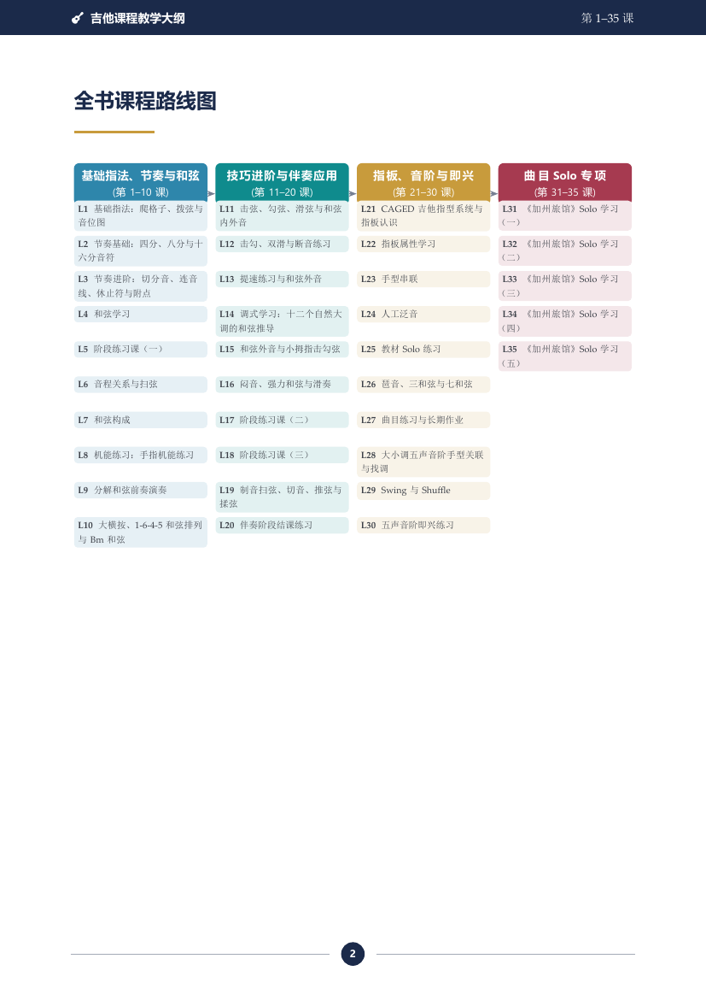
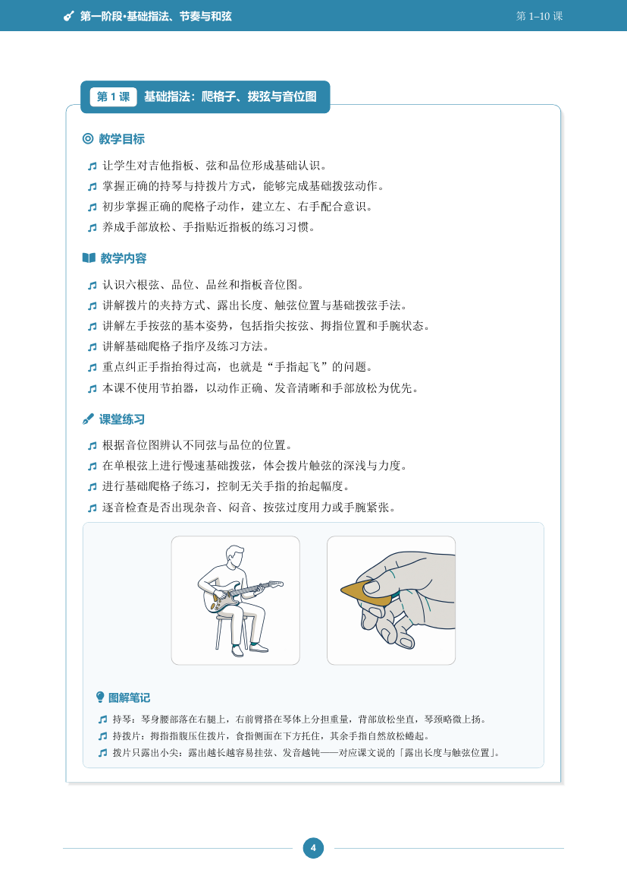
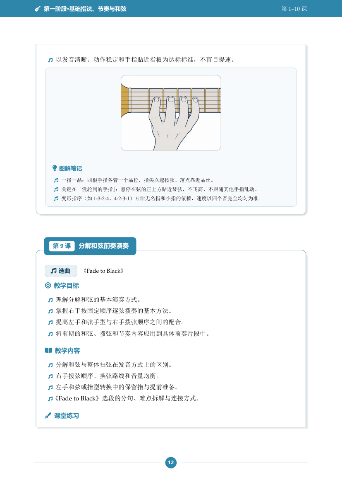
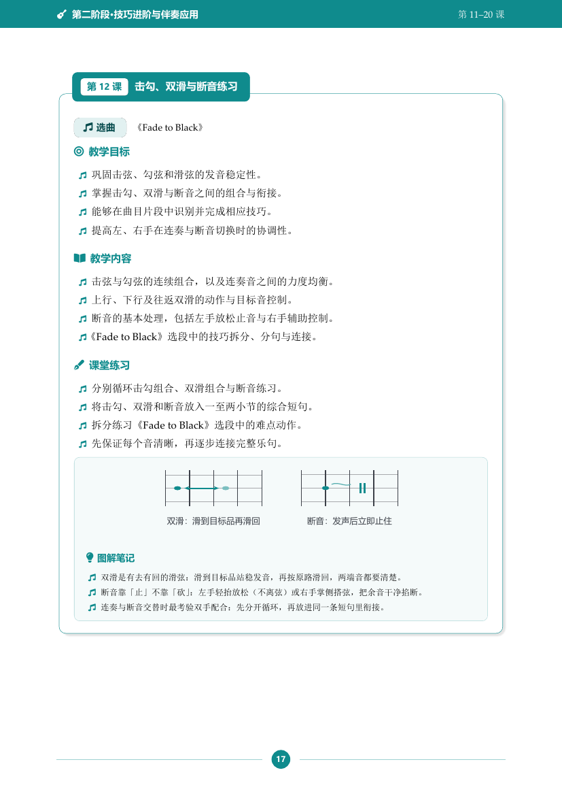
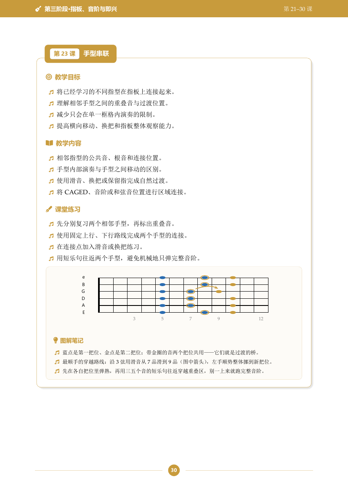

# AI 吉他教材

一份出版物级的吉他课程教学大纲：35 课、四阶段，从零基础的爬格子一路到《加州旅馆》Solo。
课程内容来自真实教学场景的口述整理，排版、配图、讲解笔记全部由 AI（Claude Code）
用 XeLaTeX 从零搭建——包括 23 套自绘矢量图和 8 张 AI 生成插画。

**成品：[`吉他课程教学大纲_第1-35课_精排版.pdf`](./吉他课程教学大纲_第1-35课_精排版.pdf)（43 页）**

## 长什么样

| 封面 | 课程路线图 | 课程卡片 |
|---|---|---|
|  |  |  |

| 图解笔记 + AI 插画 | 技巧示意图 | 指板图 |
|---|---|---|
|  |  |  |

## 内容结构

- **第一阶段（L1--10）基础指法、节奏与和弦**：持琴拨弦、节奏型、和弦入门、大横按
- **第二阶段（L11--20）技巧进阶与伴奏应用**：击勾滑、闷音、强力和弦、推弦揉弦，结课曲《One》
- **第三阶段（L21--30）指板、音阶与即兴**：CAGED、八度指型、五声音阶、Swing/Shuffle、即兴
- **第四阶段（L31--35）曲目 Solo 专项**：《加州旅馆》Solo（依整理说明暂保留课程标题）

每课固定三层结构（教学目标 / 教学内容 / 课堂练习），涉及曲目的课带选曲徽章；
第 1--30 课每课至少配一个「图解笔记」块——图在上，下面三条读图方法和动作要点。

## 排版系统亮点

- **随阶段换色**：页眉色条、阶段扉页、课程卡片、列表符号、笔记框随四个阶段自动换色，
  一个 `\SetStage` 宏驱动全书
- **全矢量图**：和弦图、指板音位图、节奏型、技巧示意、流程链全部 TikZ 绘制，印刷无损
- **AI 插画**：持琴、拨片、爬格子、横按、闷音等手型示范由 gpt-image-2 / nano-banana-2 生成，
  与全书共用同一套配色（藏青 #1B2A4A / 青 #0F8B8D / 金 #C89B3C）
- **PDF 书签导航**：四阶段 + 35 课全部可跳转

## 自己编译

环境：Windows + MiKTeX（XeLaTeX），中文字体用系统自带宋体/微软雅黑。

```bash
cd build/tex
xelatex -interaction=nonstopmode main.tex   # 编两遍（remember picture 定位需要）
xelatex -interaction=nonstopmode main.tex
```

工程结构、设计组件用法、QA 流程和踩坑记录见 [`CLAUDE.md`](./CLAUDE.md)——
这份大纲会持续维护，所有维护规范都在那里。

## 目录速览

```
吉他课程教学大纲_第1-35课_精排版.pdf   成品
吉他课程教学大纲_..._详化版.pdf        原始文档
CLAUDE.md                              维护手册（内容红线 / 组件速查 / 编译对账）
build/
  content_extracted.txt                课文唯一真源（35 课全文）
  tex/                                 XeLaTeX 工程（main.tex + guitar-macros.sty + 分阶段内容）
  images/ai/                           AI 生成插画
  gen_guitar_ai.py / gen_batch2.py     AI 插画生成脚本（双通道，密钥走本地 env 文件）
  CHECKPOINT.md / PLAN.md              制作过程记录
docs/preview/                          README 预览图
```

## 版权说明

课程内容（35 课教学文本）版权归课程作者所有；排版工程、矢量图与 AI 生成插画随仓库发布，
无第三方图片授权负担（早期版本用过的 Wikimedia 照片已全部移除）。
